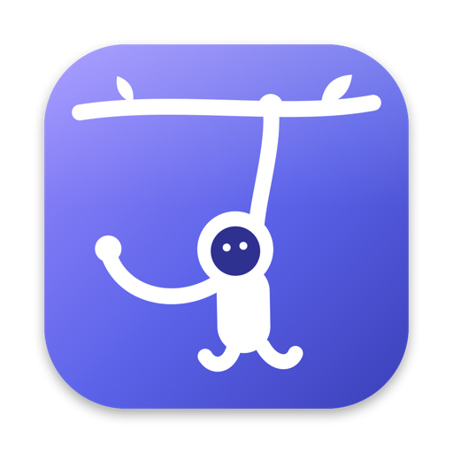
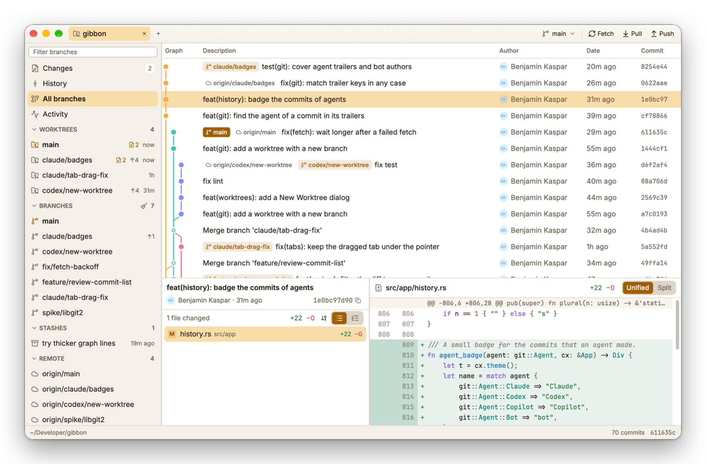
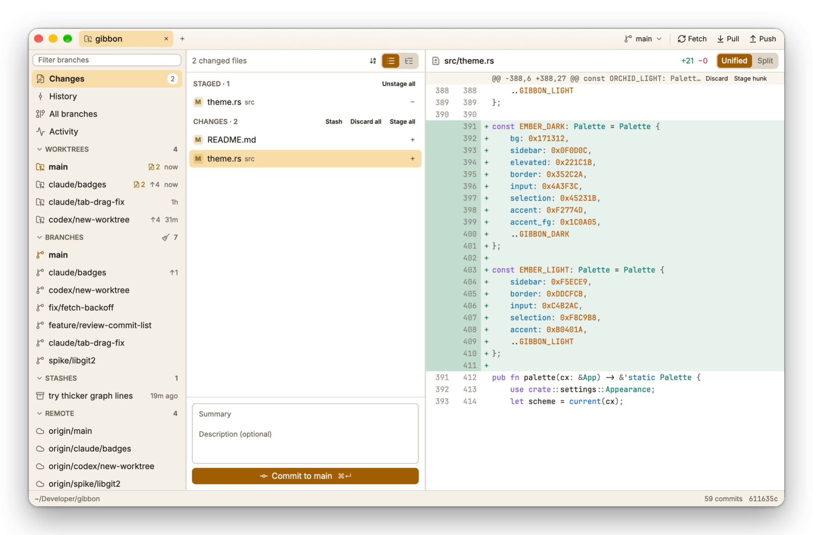
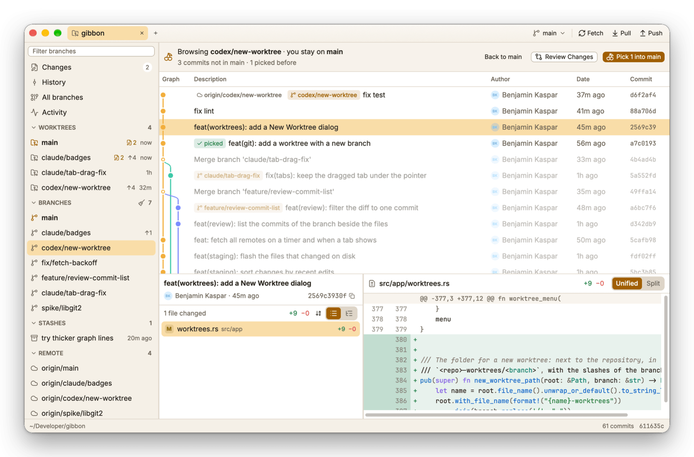
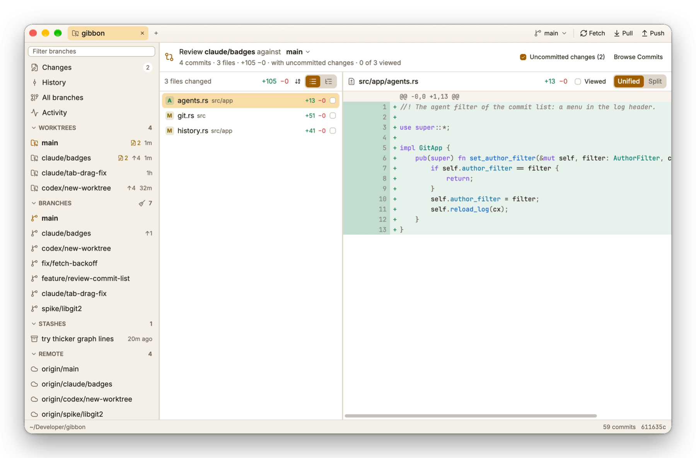
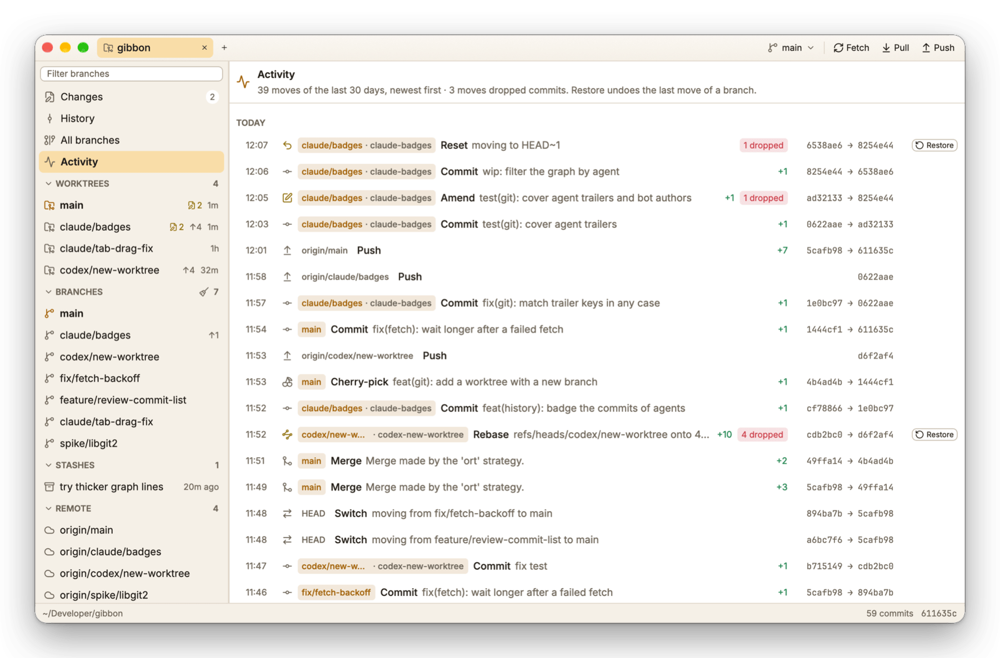
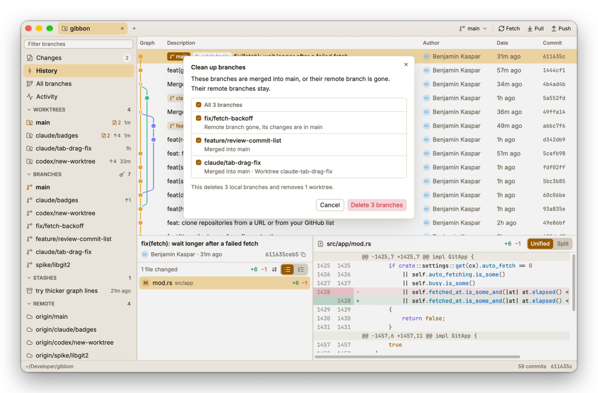
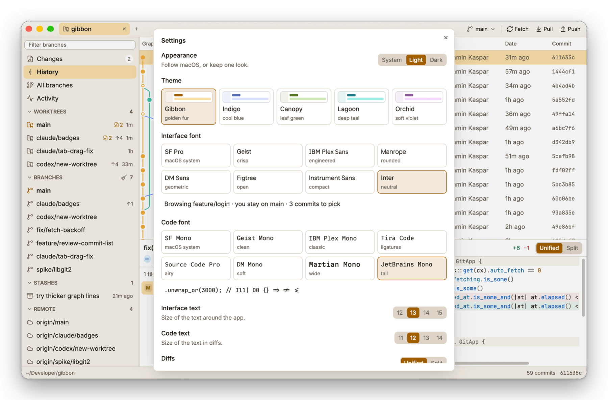

<div align="center">



# Gibbon

**Swing between branches.**

A native Git client for macOS, written in Rust on
[GPUI](https://github.com/zed-industries/zed), the GPU-rendered UI framework
behind the Zed editor.

[](LICENSE)


</div>

<picture>
  <source media="(prefers-color-scheme: dark)" srcset="docs/screenshots/history-dark.png">
  
</picture>

## Why Gibbon

- **Native.** No Electron and no web view. The commit list and the diffs are
  virtualized: Gibbon loads up to 20,000 commits and draws only the rows on
  screen.
- **Cherry-pick the right way around.** Stay on your branch, browse another
  one, and pick the commits you need into yours.
- **Real Git underneath.** Every operation runs the `git` CLI. Your hooks,
  commit signing, credential helpers and SSH keys work as they do in the
  terminal.
- **Keyboard first.** The common actions have shortcuts and live in the
  command palette (<kbd>⌘</kbd><kbd>K</kbd>).
- **Free and open source.** MIT licensed, no account, no telemetry.

## Features

### Tabs

- Each open repository has a tab in the title bar. Opening a repository adds
  a tab, or shows its tab if it is open already.
- **+** lists the recent repositories that have no tab. **Clear Recent** there,
  or **Clear** on the welcome screen, removes them from the list.
- Close a tab with its **×**, a middle-click or <kbd>⌘</kbd><kbd>W</kbd>.

### Clone

**Clone Repository…** (<kbd>⇧</kbd><kbd>⌘</kbd><kbd>O</kbd>) clones a repository
and opens it in a tab. It is in the **+** menu, the File menu, the command
palette and on the welcome screen.

- Paste a URL (HTTPS or SSH), type `owner/name` for a GitHub repository, or
  choose one of your GitHub repositories. With the
  [GitHub CLI](https://cli.github.com) signed in, the list shows up to 100
  repositories that you own, work on or see in your organizations, the last
  pushed first. Type to search it, then use <kbd>↑</kbd> <kbd>↓</kbd> and
  <kbd>↵</kbd>, or double-click a row.
- The clone goes into a folder with the name of the repository: in the
  folder of your last clone, else in `~/Developer`, `~/Projects`, `~/Code` or
  a similar folder, else in your home folder. Type another path, or choose
  another folder.
- While `gh` is signed in, a GitHub repository clones with `gh repo clone`:
  private repositories need no other sign-in, and the clone of a fork gets
  the `upstream` remote. Other repositories clone with `git clone`.
- A bar shows the progress. **Stop** ends the clone, and Git deletes what it
  downloaded.

### History and graph

- A commit graph with branch, remote and tag badges, authors and dates.
- **All branches** draws one graph for every branch, remote branch and tag.
- Commit details: the subject, the author, the date and the commit on two
  lines, then the changed files and the diff. The message folds to one line;
  click it to show all of it. The tooltip of the author shows the committer,
  the full dates and the parents.

### Diffs

- Syntax colors for about 35 languages (tree-sitter).
- Word-level highlights show exactly what changed inside a line.
- Unified or split (side-by-side) view.
- Image files (PNG, JPEG, GIF, WebP, BMP, TIFF, ICO, SVG) show as pictures:
  the old one beside the new one, each with its size in pixels and in bytes.
  An SVG file has a **Picture** / **Text** switch for its text diff.
- Markdown files have a **Rendered** / **Text** switch. **Rendered** shows
  the document before the change beside the document after it, with the
  changed text marked, and scrolls both to the first change.
- Changed files show as a list sorted by name (A to Z or Z to A) or as a
  tree of folders. All file lists use the same choice.
- The Changes list can also show the most recent edits first, by the time of
  each file on disk. A file that is deleted while the tab is open counts from
  the time Gibbon sees it go. Files that were deleted before go last.

### Staging

- Stage and unstage per file, per hunk or per line. Click the line numbers to
  select lines (<kbd>⇧</kbd>-click for a range), then **Stage lines**.
- Discard a file, a hunk, some lines or everything. Gibbon always asks first.
- Gibbon watches the repository and refreshes by itself. A file that changed
  on disk since the last refresh flashes in the list for a moment.

<picture>
  <source media="(prefers-color-scheme: dark)" srcset="docs/screenshots/changes-dark.png">
  
</picture>

### Cherry-pick into your branch

Click a branch or a pull request in the sidebar to browse it. You stay on your
branch the whole time:

- Commits your branch already has are dimmed.
- Commits you picked before are marked **picked**.
- Select commits (click, <kbd>⌘</kbd>-click, <kbd>⇧</kbd>-click) and click
  **Pick into …**. Merge commits pick against their first parent.

<picture>
  <source media="(prefers-color-scheme: dark)" srcset="docs/screenshots/pick-dark.png">
  
</picture>

### Review a branch

Agent branches often have many small commits. **Review Changes** shows all
the changes of a branch as one diff, as a pull request does: what the branch
changed since it left its base (`git diff base...branch`).

- Right-click a branch, a worktree or a pull request ▸ **Review Changes**, or
  click **Review Changes** while you browse a branch. The command palette has
  **Review …** too.
- The base is the base branch. Choose another one in the header.
- Mark each file as **Viewed**, in the list or above its diff. A file that
  changes again loses its mark. The marks stay after a restart.
- When a worktree has the branch checked out, **Uncommitted changes** adds
  the files of that worktree, new files included. That is the work of an
  agent that has not committed yet. The review updates while the agent works.

<picture>
  <source media="(prefers-color-scheme: dark)" srcset="docs/screenshots/review-dark.png">
  
</picture>

### Interactive rebase

Right-click a commit ▸ **Interactive Rebase from Here…**. Set *pick*,
*reword*, *squash*, *fixup* or *drop* per commit and reorder them. Uncommitted
changes are stashed first and restored after.

### Worktrees

Agents often work in worktrees of their own. When a repository has more than
one worktree, the sidebar lists them:

- Each row shows the worktree's branch, its changed files, the commits it has
  that the base branch does not have, and the time of its last change. The
  base branch is the default branch of the remote, else `main` or `master`.
- The rows update while agents edit, stage and commit in their worktrees.
- Click a row to open that worktree in a tab, on its Changes view.
- Right-click a row to browse its commits, review its changes, open it in
  Finder, copy its path, or remove it, with or without its branch. Gibbon
  asks first, and tells you how many changed files you lose.

### Activity

**Activity** (<kbd>⌘</kbd><kbd>4</kbd>) lists the moves of all branches in the
last 30 days, newest first, from Git's reflogs: commits, amends, rebases,
resets, merges, pulls, pushes, and the branch switches of each worktree.

- Each move shows the commits that it added and the commits that it
  dropped. An amend, a reset, a rebase or a forced push can drop commits.
- **Restore** on the last move of a branch undoes that move. Right-click any
  move to restore its branch to before or after it. Gibbon first tells you
  how many commits come back and how many leave the branch.
- Gibbon moves a branch only if nothing moved it since the timeline loaded.
  A branch that a worktree has checked out moves with `git reset --keep`
  there: uncommitted changes stay, and Git stops if they conflict.
- A restore is a move too, so you can undo it the same way.
- The moves since your last look have a dot, and the sidebar counts them.

<picture>
  <source media="(prefers-color-scheme: dark)" srcset="docs/screenshots/activity-dark.png">
  
</picture>

### Branch cleanup

Agents leave a branch, and often a worktree, for each task. **Clean Up
Branches…** lists the local branches that are merged into the base branch or
whose remote branch is gone. It deletes the ones you choose, with their
worktrees, in one step.

- Click the broom on the **Branches** header, or choose **Clean Up
  Branches…** in the branch menu of the title bar or in the command palette.
- Each branch shows why it is in the list and what goes with it: its
  worktree, the commits that the base branch does not have, and the changed
  files of its worktree.
- A squash merge makes a new commit, so the commits of the branch never
  reach the base branch. For a branch whose remote branch is gone, Gibbon
  asks GitHub (`gh`) for its pull requests. When a merged pull request has
  the commits of the branch, the branch loses nothing, and the row says
  **Merged as #12** (with the target branch for a stacked pull request).
  Commits after that pull request are lost. A pull request that was closed
  without a merge shows too.
- Without GitHub or a merged pull request, Gibbon merges the branch into the
  base branch in memory (`git merge-tree`). When that changes nothing, the
  branch loses nothing. This works only while the base branch has not
  changed the same lines since.
- The branches that lose nothing are selected at the start. Select the
  others yourself: Gibbon tells you how many commits and changed files you
  lose.
- Remote branches stay. The list never has the base branch, the fixed
  branches (`main`, `develop`, …), or a branch that the main worktree, this
  tab's worktree or a locked worktree has checked out.
- A branch that gets new commits after the list opens stays.

<picture>
  <source media="(prefers-color-scheme: dark)" srcset="docs/screenshots/cleanup-dark.png">
  
</picture>

### Branches, stashes and conflicts

- The branch and remote lists show the base branch and the fixed branches
  first (`main`, `master`, `trunk`, `develop`, `dev`, `development`,
  `staging`, `production`), then the 5 branches with the newest commits and
  the checked-out branch. **Show more** lists the others. The filter
  searches all branches.
- Create, rename, delete and switch branches (double-click to switch).
- Delete a remote branch on its remote: right-click it in the sidebar.
- Gibbon fetches all remotes of the shown tab every 10 minutes, and when you
  switch to a tab that did not fetch in the last minute. Settings change the
  time or turn it off. Only the first error of a run of failed fetches shows.
- Stash all changes, look at a stash's diff, then apply, pop or drop it.
  Right-click a stash in the sidebar to do the same without opening it.
- When a cherry-pick, rebase, merge or revert stops on a conflict, Gibbon
  shows **Continue**, **Skip** and **Abort**.

### GitHub

- Open pull requests appear in the sidebar, through the
  [GitHub CLI](https://cli.github.com) and its sign-in. Click one to browse its
  commits (forks too) and pick from it, or check it out.
- **Create Pull Request…** on a local branch pushes it and opens GitHub's form.
- Each pull request shows its status: its checks (passed, running or
  failed), its review (approved or changes requested) and merge conflicts.
  The tooltip names the failed checks. A local branch or a worktree with an
  open pull request shows the icon of its checks too, and so does the banner
  while you browse it.
- The status reloads every minute while checks run, every 5 minutes else,
  and on Fetch and Refresh (<kbd>⌘</kbd><kbd>R</kbd>). Skipped checks do not
  count.

### Make it yours

Settings (<kbd>⌘</kbd><kbd>,</kbd>) choose the look:

- Light and dark themes, or follow macOS.
- Five color themes with the same contrast: Gibbon (gold, the default),
  Indigo, Canopy, Lagoon and Orchid.
- Eight interface fonts: SF Pro, Geist, IBM Plex Sans, Manrope, DM Sans,
  Figtree, Instrument Sans and Inter.
- Eight code fonts: SF Mono, Geist Mono, IBM Plex Mono, Fira Code,
  Source Code Pro, DM Mono, Martian Mono and JetBrains Mono.
- Text sizes and the default diff view.

<picture>
  <source media="(prefers-color-scheme: dark)" srcset="docs/screenshots/settings-dark.png">
  
</picture>

Gibbon remembers its window, its tabs and the sizes of its panes, and
reopens each repository where you left it: the same view, branch, commit and
file, and the review with its Viewed marks.

## Getting started

> [!IMPORTANT]
> Gibbon targets macOS 14 or later. So far it is tested on macOS 27 on Apple
> Silicon only.

### Install

On a Mac with Apple Silicon, this command installs the latest release in
`/Applications`:

```sh
curl -fsSL https://raw.githubusercontent.com/biki/gibbon/main/scripts/install.sh | bash
```

The releases have no Apple notarization. macOS blocks an app without
notarization when a browser downloads it, until you allow it in System
Settings › Privacy & Security. The script downloads with `curl`, which does
not mark the file for this check. The script also checks the signature of
the download.

Then Gibbon updates itself. It checks for a new release when it starts and
every 12 hours, downloads it, and replaces the app when the release has the
signature of the installed app. The new version runs when you click
**Restart** or the next time you open Gibbon.
**Gibbon › Check for Updates…** checks at once, and **Settings › Updates**
turns off the automatic checks. A build with an ad hoc signature does not
update itself.

### Build from source

Prerequisites:

- [Rust](https://rustup.rs) (the repository pins the toolchain in
  `rust-toolchain.toml`)
- Xcode Command Line Tools
- Optional: the [GitHub CLI](https://cli.github.com) (`brew install gh`) for
  pull requests and for the list of your repositories in Clone

Run from source:

```sh
git clone https://github.com/biki/gibbon.git && cd gibbon
cargo run --release -- /path/to/your/repo
```

Build the app and drag it into `/Applications`:

```sh
scripts/bundle.sh      # → target/release/bundle/Gibbon.app
```

The script signs with a *Developer ID Application* certificate when your
keychain has one, then with the *Gibbon Release* certificate of the releases
(see [CONTRIBUTING.md](CONTRIBUTING.md#releases)), and ad hoc otherwise.

## Keyboard shortcuts

| Action | Shortcut |
| --- | --- |
| Command palette | <kbd>⌘</kbd><kbd>K</kbd> |
| Settings | <kbd>⌘</kbd><kbd>,</kbd> |
| Open repository (in a new tab) | <kbd>⌘</kbd><kbd>O</kbd> |
| Clone repository | <kbd>⇧</kbd><kbd>⌘</kbd><kbd>O</kbd> |
| Close tab | <kbd>⌘</kbd><kbd>W</kbd> |
| Previous / next tab | <kbd>⇧</kbd><kbd>⌘</kbd><kbd>[</kbd> / <kbd>⇧</kbd><kbd>⌘</kbd><kbd>]</kbd>, or <kbd>⌃</kbd><kbd>⇧</kbd><kbd>⇥</kbd> / <kbd>⌃</kbd><kbd>⇥</kbd> |
| Changes / History / All branches / Activity | <kbd>⌘</kbd><kbd>1</kbd> / <kbd>⌘</kbd><kbd>2</kbd> / <kbd>⌘</kbd><kbd>3</kbd> / <kbd>⌘</kbd><kbd>4</kbd> |
| Refresh | <kbd>⌘</kbd><kbd>R</kbd> |
| Commit | <kbd>⌘</kbd><kbd>↵</kbd> |
| New branch | <kbd>⇧</kbd><kbd>⌘</kbd><kbd>N</kbd> |
| Stash changes | <kbd>⌥</kbd><kbd>⌘</kbd><kbd>S</kbd> |
| Fetch / Pull / Push | <kbd>⇧</kbd><kbd>⌘</kbd><kbd>F</kbd> / <kbd>⇧</kbd><kbd>⌘</kbd><kbd>P</kbd> / <kbd>⌘</kbd><kbd>P</kbd> |
| Previous / next commit | <kbd>↑</kbd> / <kbd>↓</kbd> |

## Where your data lives

| What | Where |
| --- | --- |
| Settings, recent repositories and the last session | `~/Library/Application Support/gibbon/` |
| Fetched pull request heads | `refs/gibbon/pr/<number>` in your repository |
| Messages of a paused interactive rebase | `.git/gibbon-rebase/` in your repository |
| A downloaded update, until Gibbon installs it | `.Gibbon-update/` next to `Gibbon.app` |

## Known limits

- Hunk and line staging works for changed text files. New, deleted and binary
  files stage as a whole.
- The split view cuts lines at 1,200 characters and has no horizontal scroll.
- Rendered Markdown shows only the pictures in the repository, from the
  files on disk, also for an older version of the file. Pictures from the
  web (badges) do not show.
- The file watcher reads the top-level `.gitignore` of each worktree only, so
  ignored files in deeper folders can cause extra (harmless) refreshes.
- Interactive rebase flattens merge commits and has no *edit* or *exec* step.
- Pull requests: open ones only. Gibbon shows the review decision, not the
  reviews or the comments.
- Activity reads the reflog files. A repository in the reftable format shows
  no moves. Git deletes the reflog of a deleted branch, so its moves go too.
- The releases have no Apple notarization and run on Apple Silicon only.
  Intel Macs must build Gibbon from source.

## Development

```sh
git config core.hooksPath .githooks   # checks formatting and commit messages
scripts/dev.sh ~/path/to/repo         # rebuild and restart on every save
cargo fmt                             # format the code before each commit
cargo test                            # Git backend, graph, highlighting and watcher tests
```

`scripts/dev.sh` rebuilds Gibbon and restarts it when a source file changes,
in about 2 seconds. Gibbon reopens on the same screen and does not take focus
from your editor. In debug builds, <kbd>⌘</kbd><kbd>⌥</kbd><kbd>I</kbd> opens
the GPUI inspector: pick an element and edit its style live.

Commits follow [Conventional Commits](https://www.conventionalcommits.org/).
See [CONTRIBUTING.md](CONTRIBUTING.md) for the types and scopes.

Environment variables for automated UI checks:

| Variable | Effect |
| --- | --- |
| `GIBBON_BACKGROUND=1` | Pop-up window that stays on top but never takes focus (GPUI stops painting hidden windows) |
| `GIBBON_BROWSE=<branch or ref>` | Start in browse mode |
| `GIBBON_VIEW=changes\|all\|activity` | Start in that view |
| `GIBBON_FILE=<path>` | Select that changed file |
| `GIBBON_DIFF=split` | Split diffs |
| `GIBBON_REBASE=<sha>` | Open the rebase planner from that commit |
| `GIBBON_STASH=<n>` | Open `stash@{n}` |
| `GIBBON_REVIEW=<branch or ref>` | Review that branch against the base branch |
| `GIBBON_DIALOG=new-branch\|stash\|palette\|settings\|restore\|cleanup\|clone` | Open that dialog (restore: for the newest move that dropped commits) |
| `GIBBON_INSPECTOR=1` | Open the inspector (debug builds) |
| `GIBBON_NO_ACTIVATE=1` | Open the window without taking focus (the dev loop sets it) |
| `GIBBON_RELEASES=<url>` | Read the latest release from this URL, in the JSON of the GitHub API (a `file://` URL works). Update checks then run also with `GIBBON_BACKGROUND=1` |

`scripts/screenshots.sh` takes the screenshots of this README again. It
builds a demo repository with agent branches from Gibbon's own history,
opens Gibbon on it in each view, in dark and in light, and writes
`docs/screenshots/`. Gibbon windows pop up on top for about two minutes.

## Built with

[GPUI](https://github.com/zed-industries/zed) and
[GPUI Kit](https://github.com/longbridge/gpui-kit) for the UI,
[tree-sitter](https://tree-sitter.github.io) for syntax colors,
[similar](https://github.com/mitsuhiko/similar) for word diffs and
[notify](https://github.com/notify-rs/notify) for file watching.

## License

[MIT](LICENSE) © 2026 Benjamin Kaspar.
All bundled fonts use the SIL Open Font License 1.1; each license is in
`assets/fonts/`. `scripts/fetch-fonts.sh` downloads them from Google Fonts.
SF Pro and SF Mono come from macOS and are not bundled.
